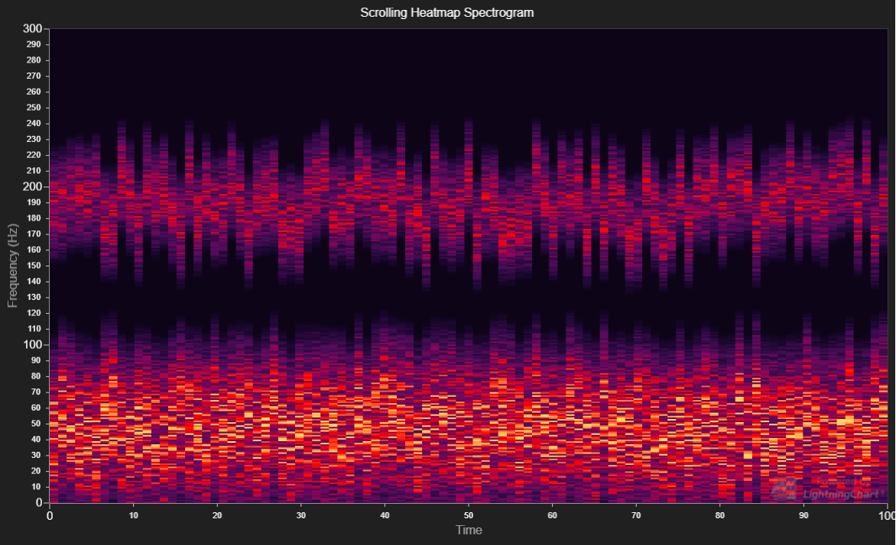

# Scrolling Heatmap



This demo application belongs to the set of examples for LightningChart JS, data visualization library for JavaScript.

LightningChart JS is entirely GPU accelerated and performance optimized charting library for presenting massive amounts of data. It offers an easy way of creating sophisticated and interactive charts and adding them to your website or web application.

The demo can be used as an example or a seed project. Local execution requires the following steps:

- Make sure that relevant version of [Node.js](https://nodejs.org/en/download/) is installed
- Open the project folder in a terminal:

        npm install              # fetches dependencies
        npm start                # builds an application and starts the development server

- The application is available at *http://localhost:8080* in your browser, webpack-dev-server provides hot reload functionality.


## Description

This example shows a simple use-case scenario for a Heatmap, with a toggleable mode for either scrolling or sweeping update of the values.

When adding data to a Heatmap, users can use two different methods. The first ones, *addColumn* and *addRow*, always add data to the end
of the Matrix (horizontally or vertically, respectful of which method is used) and shift the previously added data to accommodate the new data.

```js
// Add new column to the end of the Matrix. In most cases, this would be the right-most column in the Heatmap.
// Older data gets shifted to the left by one column.
grid.addColumn(1, 'value', [values])
```

Additionally, it is possible to use the *invalidateValuesOnly* method to replace data in the Heatmap. This is useful when creating a *sweeping*
update for the Heatmap.

```js
// Use invalidateValuesOnly to change values in the Matrix with values we want.
grid.invalidateValuesOnly(
    // New data for the Heatmap.
    remappedData,
    {
        // Columns to modify: In this example, we're only changing one column worth of data.
        column: { start: ind, end: ind + 1 },
        // Rows to modify: In this example, all the rows in a single column need to be changed, so
        // we start from the first index and end in the last.
        row: { start: 0, end: resolution - 1 }
    }
)
```


## API Links

* [Intensity Series Types]
* [Intensity Grid]
* [Paletted Fill Style]
* [LUT]


## Support

If you notice an error in the example code, please open an issue on [GitHub][0] repository of the entire example.

Official [API documentation][1] can be found on [Arction][2] website.

If the docs and other materials do not solve your problem as well as implementation help is needed, ask on [StackOverflow][3] (tagged lightningchart).

If you think you found a bug in the LightningChart JavaScript library, please contact support@arction.com.

Direct developer email support can be purchased through a [Support Plan][4] or by contacting sales@arction.com.

[0]: https://github.com/Arction/
[1]: https://www.arction.com/lightningchart-js-api-documentation/
[2]: https://www.arction.com
[3]: https://stackoverflow.com/questions/tagged/lightningchart
[4]: https://www.arction.com/support-services/

© Arction Ltd 2009-2020. All rights reserved.


[Intensity Series Types]: https://www.arction.com/lightningchart-js-api-documentation/v2.0.0/globals.html#intensityseriestypes
[Intensity Grid]: https://www.arction.com/lightningchart-js-api-documentation/v2.0.0/classes/intensitygridseries.html
[Paletted Fill Style]: https://www.arction.com/lightningchart-js-api-documentation/v2.0.0/classes/palettedfill.html
[LUT]: https://www.arction.com/lightningchart-js-api-documentation/v2.0.0/classes/lut.html

